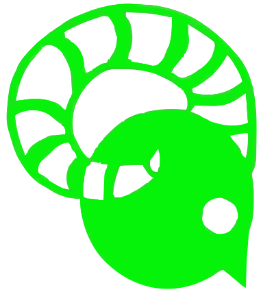

# **Faun**

    

        A fullstack app for streaming and automated download of music. Implemented with Flask, mongo, next and android.

    

    

# motivation

My sole motivation is that i cant afford spotify premium.

