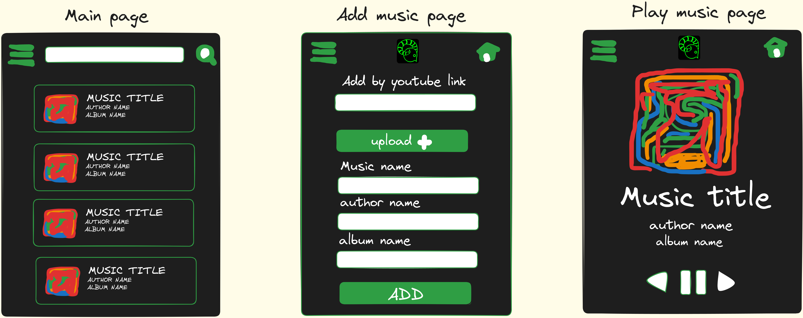

# **Faun**


## sketchs das páginas num android

<div>
    
</div>
​    

## rotas no backend

Adicionar nova musica por youtube link

```bash
POST /api/music/add/bylink
req={
	"link":"www.youyube/linkdamusica.ajksldçfjafwiejaiqwerqwoier"
	"title":"music title",
	"album":"album name",
	"author":"author name",
}
```

Adicionar nova musica por upload

```bash
POST /api/music/add/
req={
	"music": binartfile,
	"title":"music title",
	"album":"album name",
	"author":"author name",
}
```

Receber musica por titulo

```bash
get /api/music/<title>
RES={
	"music": binartfile,
	"title":"music title",
	"album":"album name",
	"author":"author name",
}
```


outras rotas:

```bash
alterar atributos da musica
put /api/music/<id> ;  REQ= novos atributos

receber todas as musicas
get /api/music/all  ;

receber enesima partição de tamnha t todas as musicas
get /api/music/fetch/part=n?tam=t  ;

```


## banco de dados


| Music      | type                   |
| ---------- | ---------------------- |
| title      | string                 |
| author     | string                 |
| album      | string                 |
| music      | binary file            |
| date_added | date                   |
| alikes     | list of other music id |

# motivation

My sole motivation is that i cant afford spotify premium.


